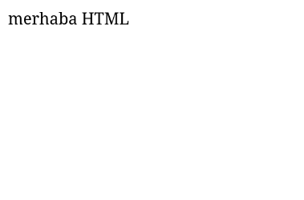

# HTML

WEB sitesi geliştirirken bilmemiz gereken en temel, en önemli, yapıtaşı HTML'dir. HTML olmazsa site olamaz. HTML ile sitenin yapısını belirlersin. Açılımı **HyperText Markup Language** yani **Hiper Metin İşaretleme Dili**'dir. Genellikle **CSS ve JS** ile beraber kullanılır ama onları daha sonra göreceğiz

HTML dosyalarının uzantısı `.html`'dir. Dosyanın içine **Merhaba HTML**

```html
merhaba HTML
```



