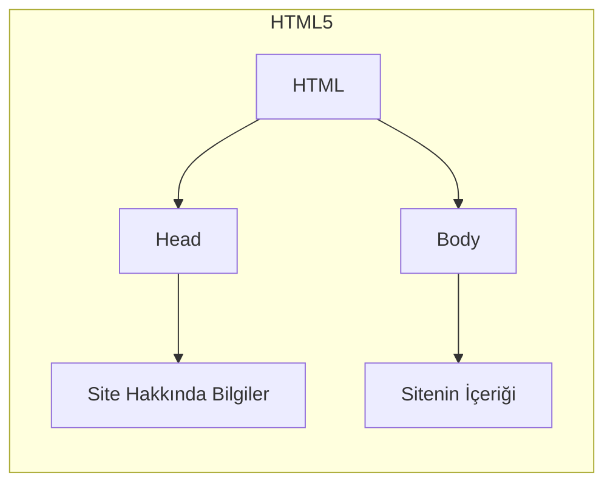
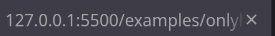
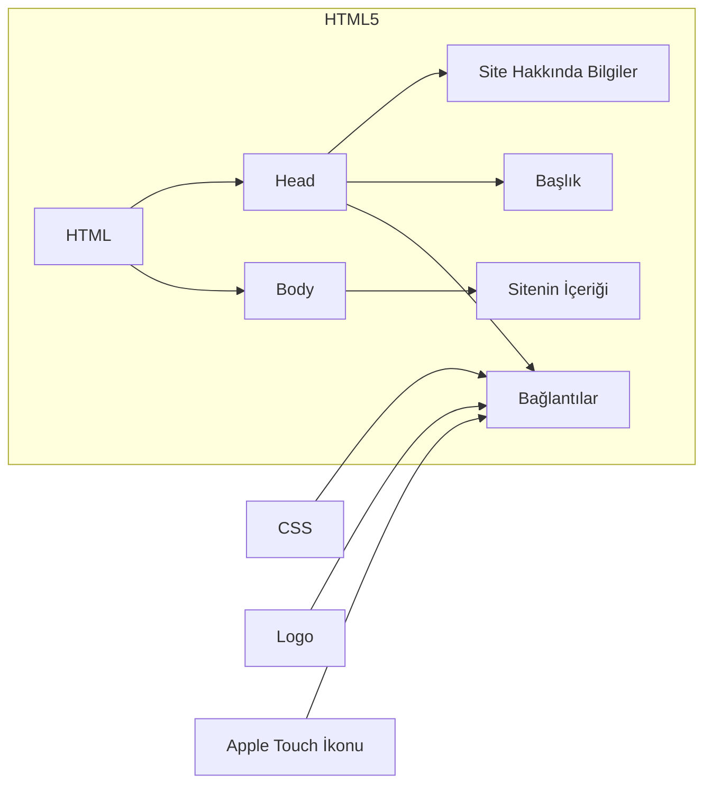
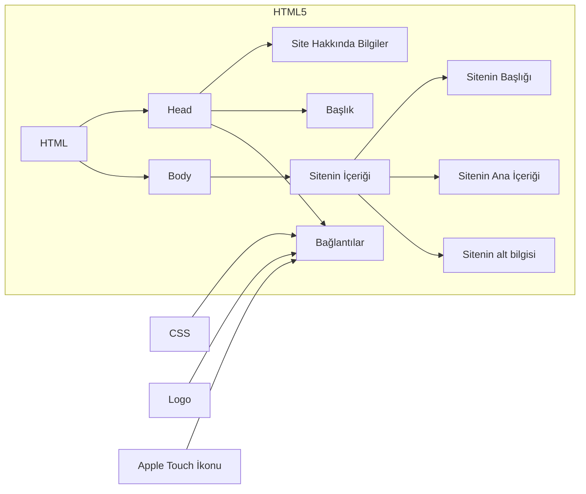

# Sayfa yapısı

HTML dosyaları öncelikle `<!DOCTYPE html>` ile başlar. Bu kendi kendine kapanan element, sayfanın HTML5 olmasını sağlar

```html
<!DOCTYPE html>
```

onun altına `<html>` elementi gelir. HTML sayfasının bütün her şeyi buraya yazılır. Genelde **lang** özelliği ile beraber kullanılır. Bu sayfanın dilini belirtir, özellikle tarayıcı motorları ve görme engelliler için olan ekran okuyucular için de önemlidir

```html
<!DOCTYPE html>
<html lang="tr"></html>
```

html'in altına 2 farklı element gelir. İlki `<head>` ikincisi de `<body>`. Head, sitenin meta bilgilerini yani arama motorunun okuduğu bilgileri içerirken body de kullanıcıların gördüğü bilgileri içerir

```html
<!DOCTYPE html>
<html lang="tr">
    <head></head>
    <body></body>
</html>
```



## Head Yapısı

Head kısmı, sitenin görünmeyen bölümüdür, tarayıcı açısından çok önemli olmasına rağmen kullanıcı göremez

Genellikle `<title>`, `<meta>` ve `link` etiketlerinden oluşur

&lt;title&gt; etiketi sitenin başlığıdır. Aslında kullanıcı tarafından doğrunan görünen tek budur

<br>

öncesi:



```html
<!DOCTYPE html>
<html lang="tr">
    <head>
        <title>WEB sitem</title>
    </head>
    <body></body>
</html>
```


meta etiketi ise sitenin meta bilgileri yani SEO'nun okudğu bilgileri içerir. İlk olarak, meta'nın **charset** özelliği, sitenin karakter kodlamasını belirler, genellikle **utf-8** tercih edilir

```html
<!DOCTYPE html>
<html lang="tr">
    <head>
        <title>WEB sitem</title>
        <meta charset="utf-8">
    </head>
    <body></body>
</html>
```

başka olarak, `name` ve `content` özelliği çiftleri de alır. Name, hangi meta verisi olduğunu, content ise o meta veriye verilen değerdir. `description` meta verisi sitenin açıklamasını belirler. `keywords` anahtar kelimelerini. Birden fazla anahtar kelime virgül ile ayrılır. `author` yazar bilgisini içerir

```html
<!DOCTYPE html>
<html lang="tr">
    <head>
        <title>WEB sitem</title>
        <meta charset="utf-8">
        <meta name="author" content="yok1rai">
        <meta name="description" content="basit bir WEB sitesi">
        <meta name="keywords" content="edu, html, css, js, web">
    </head>
    <body></body>
</html>
```

**viewport** meta özelliği sayfanın mobil cihazlardaki boyutunu belirler. Standart olarak, web sitelerinin neredeyse hepsinde `<meta name="viewport" content="width=device-width, initial-scale=1.0"` olarak yazılır. width=device-width kısmı sitenin genişliğinin cihaz ekranının genişliği kadar büyük olacağını söyler. initial-scale ise başlangıçtaki zooms seviyesini gösterir, eğer 0.5 verirsen çok küçük, 2.0 verirsen de çok büyük görünür. Varsayılan olarak 1.0'dır

öteki önemli meta etiketi ise **robots**'dur. Arama motoru robotlarının siteye nasıl davranması gerektiğini söyler. Değer olarak index/noindex veya follow/nofollow alır. **index**, sitenin aramada çıkmasını sağlar (varsayılan), **noindex** ise çıkmamasını. **follow**, sayfadaki linkleri tarayıcının takip edip etmesi için kullanılır, **nofollow** ise kullanılmamasını. Genelde bloglar veya forum siteleri spam ihtimaline karşı nofollow ekler çünkü sitede tıklanan her link o sayfanın SEO değerini arttırır, ama nofollow bunu engeller

```html
<!DOCTYPE html>
<html lang="tr">
    <head>
        <title>WEB sitem</title>
        <meta charset="utf-8">
        <meta name="author" content="yok1rai">
        <meta name="description" content="basit bir WEB sitesi">
        <meta name="keywords" content="edu, html, css, js, web">
        <meta name="viewport" content="width=device-width, initial-scale=1.0">
        <meta name="robots" content="index, nofollow">
    </head>
    <body></body>
</html>
```

sayfayı başka bir kaynağa bağlamak için `<link>` etiketi kullanılır. En sık bağlanılan şey **stylesheet**, **icon** ve **apple-touch-icon**'dur. Stylesheet, CSS dosyasına bağlar, icon sayfaya kapak fotoğrafı ekler ve apple-touch-icon ise iOS cihazlarında siteniz için ekrana eklenen görüntüdür


```html
<!DOCTYPE html>
<html lang="tr">
    <head>
        <title>WEB sitem</title>

        <meta charset="utf-8">
        <meta name="author" content="yok1rai">
        <meta name="description" content="basit bir WEB sitesi">
        <meta name="keywords" content="edu, html, css, js, web">
        <meta name="viewport" content="width=device-width, initial-scale=1.0">
        <meta name="robots" content="index, nofollow">

        <link rel="stylesheet" href="style.css">
        <link rel="icon" href="../images/favicon.ico" type="image/x-icon">
        <link rel="apple-touch-icon" href="../images/apple-touch-icon.png">
    </head>
    <body></body>
</html>
```

burada rel özelliği bağlantının türünü, stylesheet'teki content CSS dosyasınının konumunu gösterir. href ise icon'un konumu ve type da resimin türüdür



## Body Yapısı

head'in aksine, body sitenin görünen kısmıdır. Kullanıcı ve SEO açısından en önemli kısım burasıdır. Bütün olay genellikle burada gerçekleşir

detaylarına ileride geçiceğiz ama temelde 3 kısımdan oluşur: `<header>`, `<main>` ve `<footer>`

1. **header**: sitenin üst kısmı, genellikle logo, başlık, menü ve navigasyon içindir

```html
<!DOCTYPE html>
<html lang="tr">
    <head>
        <title>WEB sitem</title>

        <meta charset="utf-8">
        <meta name="author" content="yok1rai">
        <meta name="description" content="basit bir WEB sitesi">
        <meta name="keywords" content="edu, html, css, js, web">
        <meta name="viewport" content="width=device-width, initial-scale=1.0">
        <meta name="robots" content="index, nofollow">

        <link rel="stylesheet" href="style.css">
        <link rel="icon" href="../images/favicon.ico" type="image/x-icon">
        <link rel="apple-touch-icon" href="../images/apple-touch-icon.png">
    </head>
    <body>
        <header>
            WEB Sitesi
        </header>
    </body>
</html>
```

2. **main**: sayfanın ana içeriği, kullanıcıların asıl görmek istediği bilgiler, bölümler ve içerikler burada

```html
<!DOCTYPE html>
<html lang="tr">
    <head>
        <title>WEB sitem</title>

        <meta charset="utf-8">
        <meta name="author" content="yok1rai">
        <meta name="description" content="basit bir WEB sitesi">
        <meta name="keywords" content="edu, html, css, js, web">
        <meta name="viewport" content="width=device-width, initial-scale=1.0">
        <meta name="robots" content="index, nofollow">

        <link rel="stylesheet" href="style.css">
        <link rel="icon" href="../images/favicon.ico" type="image/x-icon">
        <link rel="apple-touch-icon" href="../images/apple-touch-icon.png">
    </head>
    <body>
        <header>
            WEB Sitesi
        </header>
        <main>
            Ana Bölüm:
            Burada sitenin ana içeriği yer alır. Kullanıcı buradaki bilgileri okur.
            Hakkında:
            Bu bölüm site veya yazar hakkında bilgiler içerir.
        </main>
    </body>
</html>
```

3. **footer**: sayfanın alt kısmı, Telif hakkı bilgisi, iletişim, sosyal medya linkleri ve ekstra bilgiler genellikle burada yer alır

```html
<!DOCTYPE html>
<html lang="tr">
    <head>
        <title>WEB sitem</title>

        <meta charset="utf-8">
        <meta name="author" content="yok1rai">
        <meta name="description" content="basit bir WEB sitesi">
        <meta name="keywords" content="edu, html, css, js, web">
        <meta name="viewport" content="width=device-width, initial-scale=1.0">
        <meta name="robots" content="index, nofollow">

        <link rel="stylesheet" href="style.css">
        <link rel="icon" href="../images/favicon.ico" type="image/x-icon">
        <link rel="apple-touch-icon" href="../images/apple-touch-icon.png">
    </head>
    <body>
        <header>
            WEB Sitesi
        </header>
        <main>
            Ana Bölüm:
            Burada sitenin ana içeriği yer alır. Kullanıcı buradaki bilgileri okur.
            Hakkında:
            Bu bölüm site veya yazar hakkında bilgiler içerir.
        </main>
        <footer>
            © 2026 Benim Web Sitem | Tüm Hakları Saklıdır
        </footer>
    </body>
</html>
```

not: normalde bir WEB sitesinin body kısmı böyle yazılmaz. Paragraflar, başlıklar için özel etiketler kullanılır ama ben sadece &lt;header&gt;, &lt;main&gt; ve &lt;footer&gt; etiketini göstermek için yalın bir şekilde yazdım


